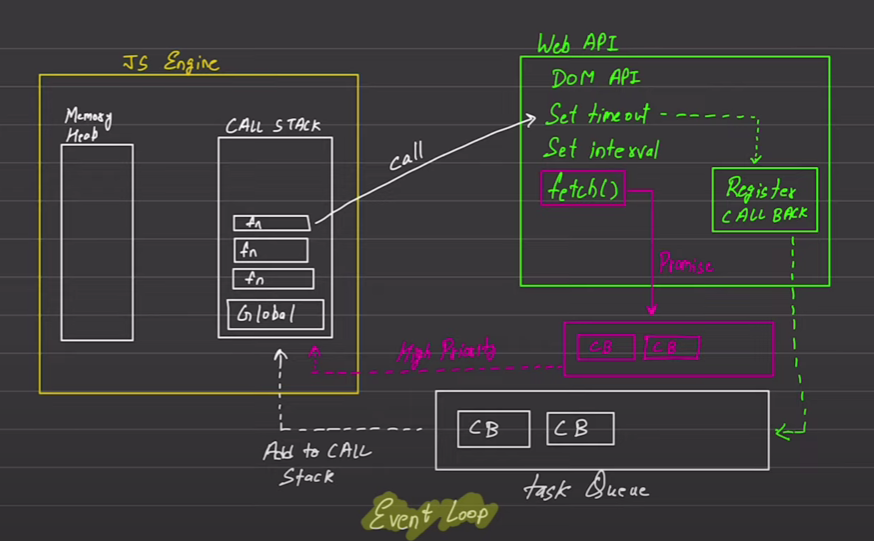

# Async JS Fundamentals

## JavaScript:

_Default javascript has these following features embedded in it:_

- **Synchronous**
- **Single threaded**

## Execution Context:

_Execution one line of code at a time (Each operation waits for the lost one to complete before completion) ._
| **Blocking Code** | **Non Blocking Code** |
| :------------- | :----------------- |
| Blocks the flow of program. | Does not block execution. |
| Reads file in sync. | Reads file in async. |

